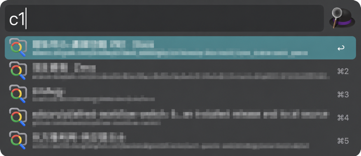
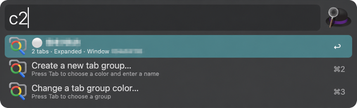
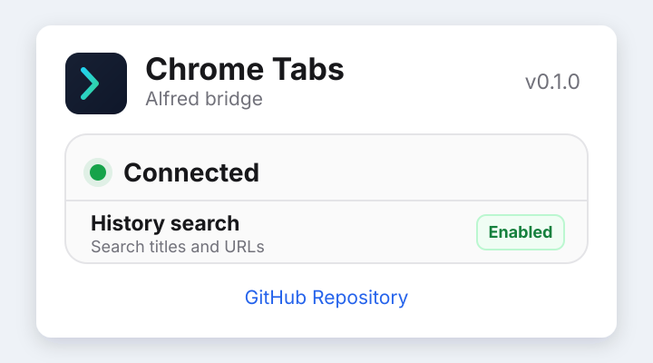

# Chrome Tabs

Search and manage Google Chrome tabs, tab groups, and history from Alfred.

**English** · [简体中文](README.zh-CN.md)

## Usage

### Search Chrome tabs

Type `c1` to list every open Chrome tab, then continue typing to filter by title or URL. Press Return to focus the selected tab.



### Manage Chrome tab groups

Type `c2` to list Chrome tab groups. Existing groups always appear before management commands.



### Search Chrome history

Open the Chrome extension popup and enable **History search** once, then type `c3` to browse recent pages or `c3 <query>` to search titles and URLs. Return focuses an already-open matching tab or opens a new one; Command-Return always opens a new Chrome tab.

| Command | Action |
| --- | --- |
| `c1` | Search and focus open Chrome tabs |
| `c2` | Search and focus Chrome tab groups |
| `c2 new` | Choose a color, then create a group from the current tab |
| `c2 new <name>` | Create a grey group |
| `c2 new <color> <name>` | Create a group with an explicit Chrome color |
| `c2 color` | Choose an existing group and change its color |
| `c3` | Browse and search Chrome history from the past year |

Group result modifiers:

| Shortcut | Action |
| --- | --- |
| `⌥↩` | Collapse or expand the group |
| `⇧↩` | Add the current Chrome tab |
| `⌃↩` | Ungroup all tabs without closing them |
| `⌘↩` | Close every tab in the group |

### Check the Bridge

The Chrome toolbar popup shows the extension version and live Native Messaging Bridge state.
It also lets you grant the optional History Search permission and open the project documentation.



## Install

- [Download Chrome Tabs for Alfred](https://github.com/wilsonyiyi/alfred-chrome-tabs/releases/latest/download/Chrome-Tabs.alfredworkflow)
- [Download the Chrome Tabs Bridge extension](https://github.com/wilsonyiyi/alfred-chrome-tabs/releases/latest/download/Chrome-Tabs-Bridge.zip)

Install the Alfred workflow first. Then:

1. Extract `Chrome-Tabs-Bridge.zip` to a stable location.
2. Run `install-native-host.command`.
3. Open `chrome://extensions` in Google Chrome.
4. Enable Developer mode.
5. Choose **Load unpacked** and select the extracted `extension` directory.

Keep the unpacked extension directory in place because Chrome loads it from that location.

## How it works

`c1` uses a fast JXA path: it reads every Chrome tab in a single batch and lets Alfred filter the in-memory results. It does not require the Chrome Extension Bridge.

Tab Group and History features use a separate bridge because Chrome's Apple Events interface does not expose the required APIs:

```text
Alfred c2 / c3 command
  -> local Unix socket
  -> Chrome Native Messaging host
  -> bundled Manifest V3 extension
  -> chrome.tabGroups / chrome.history / chrome.tabs APIs
```

The open Native Messaging port keeps the Manifest V3 service worker active during normal operation. If the host exits, the extension retries immediately and a Chrome Alarm watchdog continues recovery even after the service worker becomes dormant. Opening the popup also verifies that a connection exists; manual retry remains available for persistent installation errors.

The Native Host is owned by Chrome rather than installed as a separate launch daemon. Chrome starts it when the extension opens the Native Messaging port and stops it with that port; reconnect and Alarm watchdog logic provides the resident, self-healing behavior.

## Requirements

- macOS
- Alfred 4+ with Powerpack
- Google Chrome 120+
- Node.js 20+

## Development

Install dependencies:

```sh
npm install
```

Install and verify the native host, then load the local `extension` directory from `chrome://extensions`:

```sh
npm run bridge:install
npm run bridge:doctor
```

Switch the installed Alfred workflow slot to this local source:

```sh
npm run dev
```

Inspect or restore the workflow slot:

```sh
npm run mode
npm run doctor
npm run prod
```

Run the complete project checks:

```sh
npm run check
```

Build both distributable release assets:

```sh
npm run package:release
```

The source `info.plist` is always the complete development workflow with bundle ID `com.wilsonyiyi.alfred-chrome-tabs.dev`. Release packaging creates a separate production copy with bundle ID `com.wilsonyiyi.alfred-chrome-tabs`.

After CI passes on `main`, semantic-release analyzes Conventional Commits and automatically creates the next version (`fix` → patch, `feat` → minor, breaking change → major). It synchronizes `package.json`, `package-lock.json`, `info.plist`, and the Chrome extension manifest, rebuilds both assets, creates the Git tag and GitHub Release, then commits the synchronized versions back to `main`.

Every GitHub Release contains `Chrome-Tabs.alfredworkflow` and `Chrome-Tabs-Bridge.zip`; no manual version edit or tag push is required.

## Native Bridge CLI

All Tab Group Bridge methods are available from the terminal:

```sh
npm run tabgroup -- list
npm run tabgroup -- focus 123
npm run tabgroup -- create Work
npm run tabgroup -- rename 123 Research
npm run tabgroup -- color 123 purple
npm run tabgroup -- collapse 123 toggle
npm run tabgroup -- add-current 123
npm run tabgroup -- remove-current
npm run tabgroup -- move 123 456 -1
npm run tabgroup -- ungroup 123
npm run tabgroup -- close 123
```

## License

MIT
